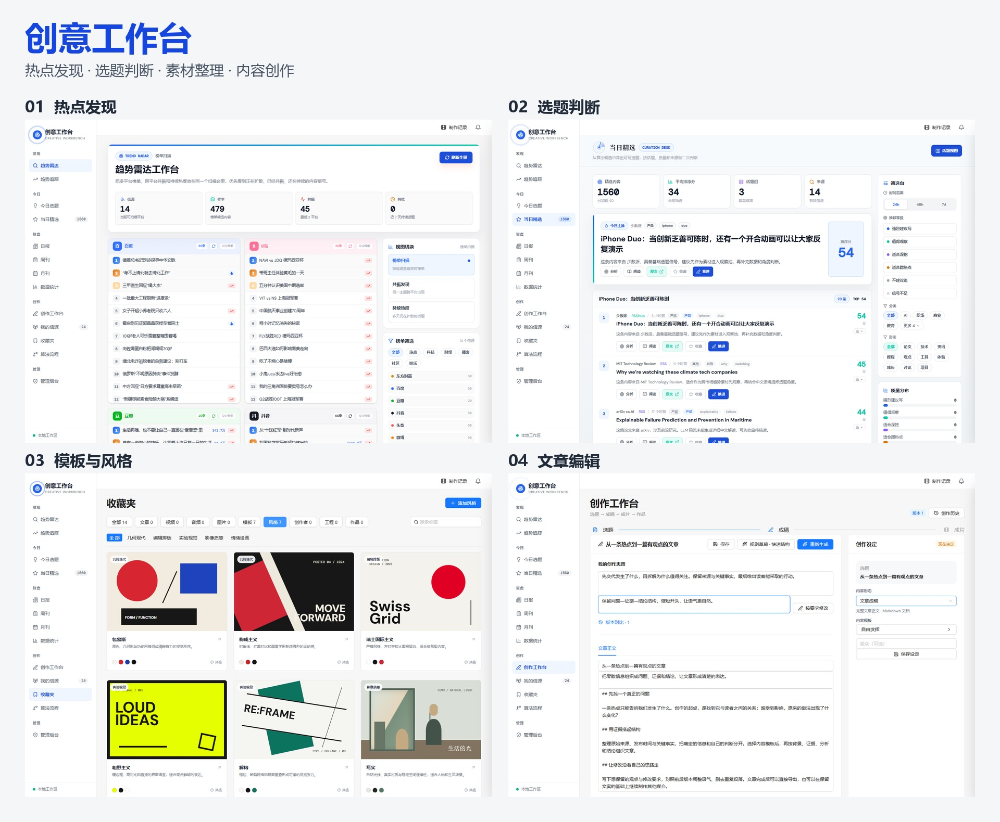
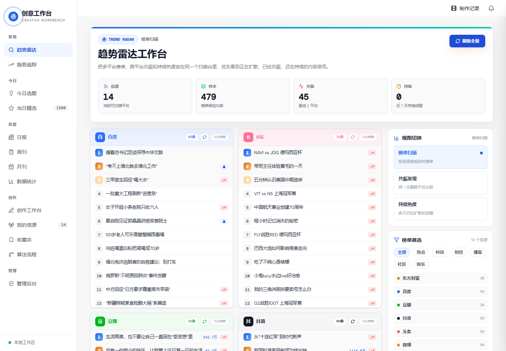
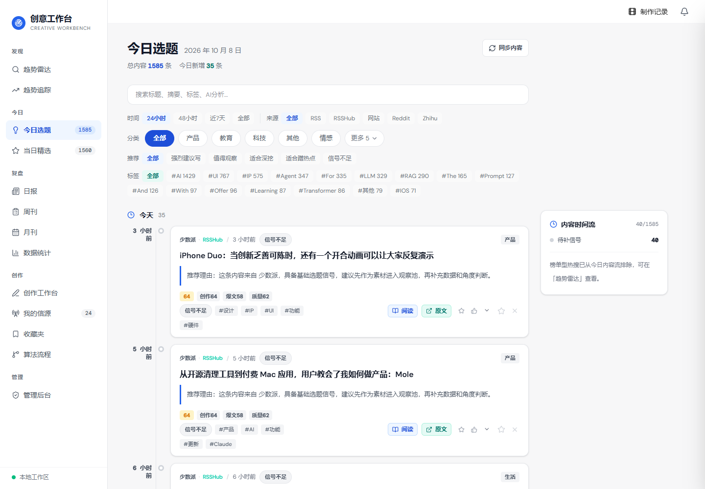
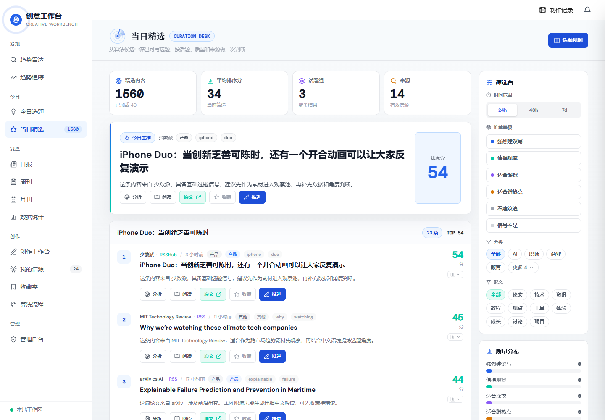
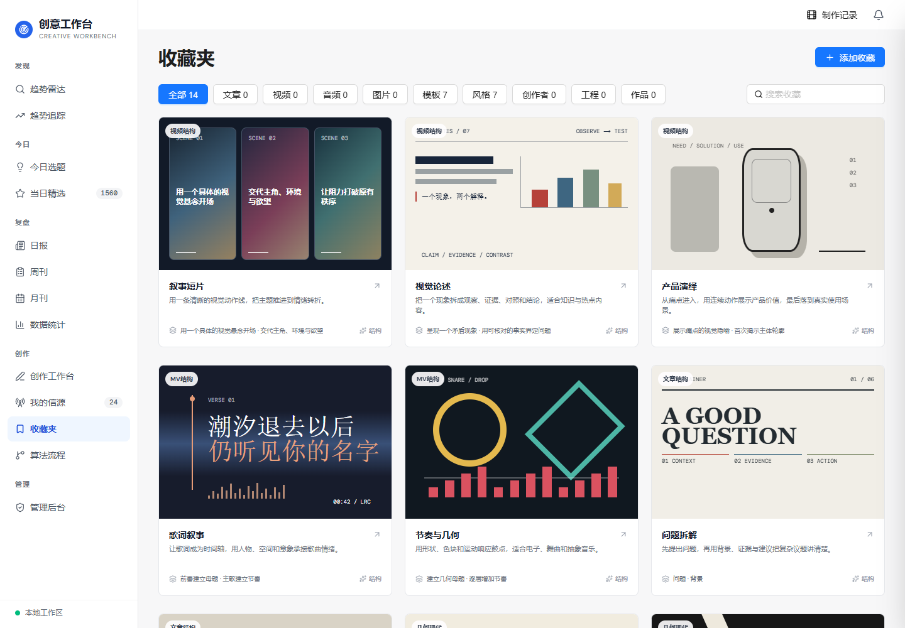
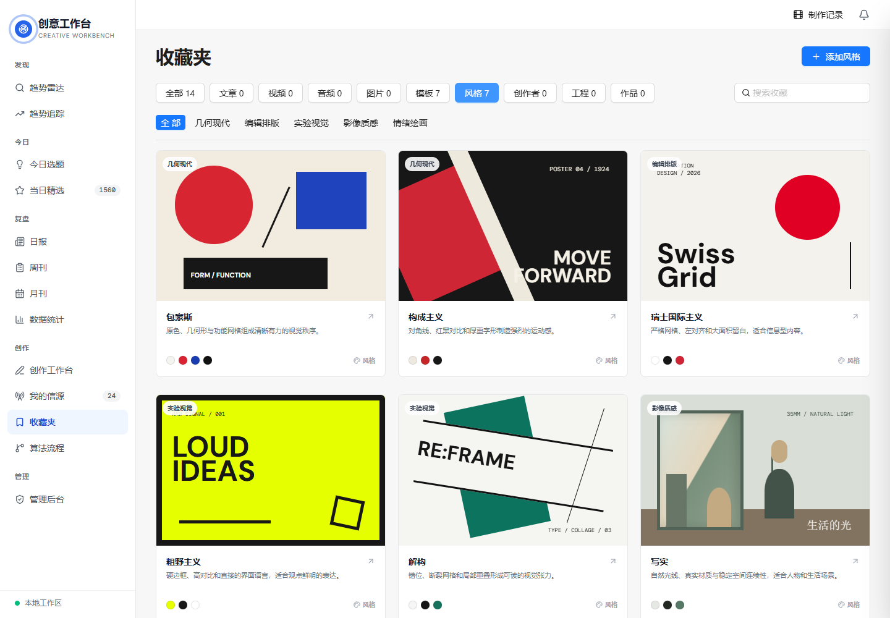
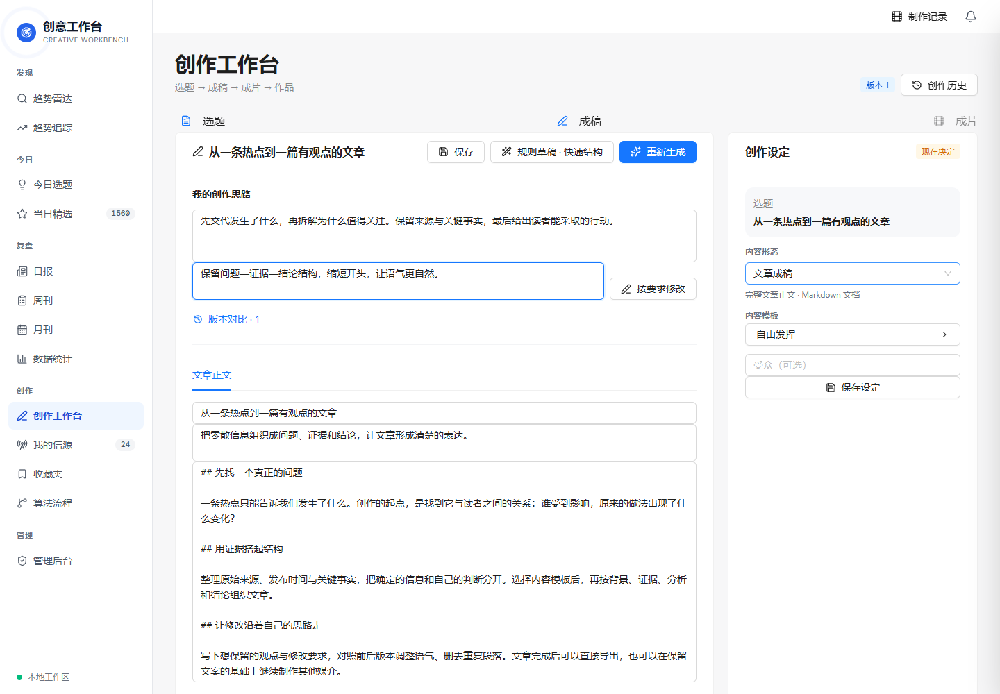
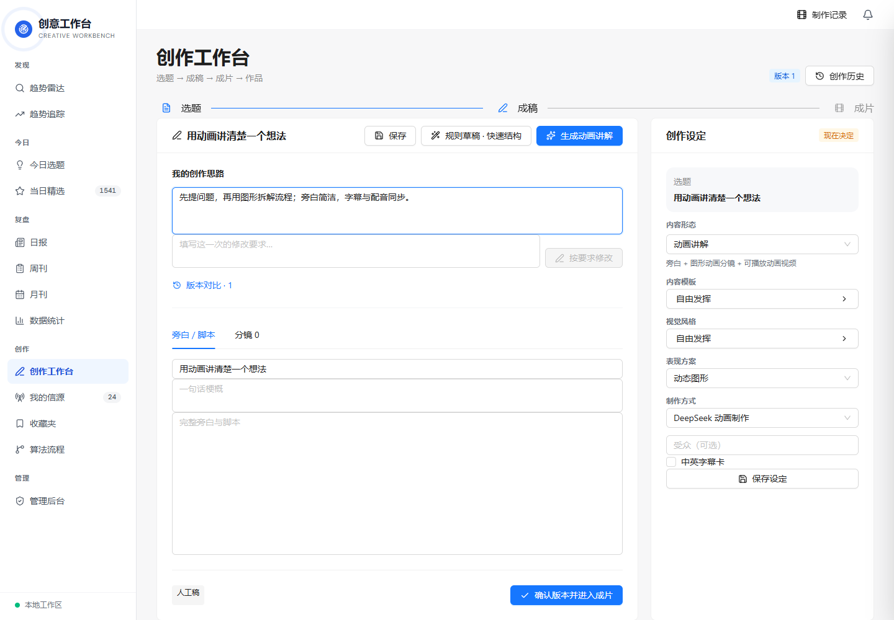

# 创意工作台



本地优先的 AI 内容创作工作台，把热点资料、选题判断、内容编辑和视频制作放在一条可操作的流程里。

**热点 / 素材 → 选题判断 → 模板与参考 → 成稿与修订 → 文章 / 视频 / MV**

## 功能

- **发现与整理**：多源热点、RSS 与创作者信源，素材收藏、来源记录、趋势观测。
- **选题判断**：内容评分、来源加权、时效衰减和排序依据。
- **成稿与编辑**：自由主题输入、创作思路、AI 初稿、按要求修改及版本对比。
- **创作参考**：内容模板和视觉风格分别选择，支持收藏与复用。
- **动画讲解**：DeepSeek Harness 生成 React / Remotion 场景，结合千问配音和中文字幕导出视频。
- **音乐 MV**：上传歌曲与 LRC，按音频和歌词时间组织动画画面。
- **作品管理**：任务状态、成片预览、MP4 下载及动画源工程保存。

内容模板决定叙事结构，视觉风格决定画面语言，制作方案决定输出形式。单用户使用，数据保存在本地 PostgreSQL；模型推理通过用户配置的服务调用。

## 从发现到创作

### 热点发现

跨平台榜单、热点共振和持续热度，配合来源与时间筛选，找到值得继续研究的方向。



### 选题与判断

今日内容按来源、分类和时间组织；当日精选展示排序分与推荐依据，可继续阅读、收藏或进入创作。





### 素材、模板与风格

收藏夹集中管理资料与创作参考，内容模板和视觉风格独立分类，以可视化卡片选择和复用。





### 文章与稿件修订

填写自己的创作思路，编辑正文，提出改稿要求并对比版本。文章成稿可作为独立输出。



文章截图使用手工示例，展示编辑界面与修改入口。

### 视频与多媒介输出

稿件也可以继续组织为分镜，搭配配音、字幕、动画或歌曲节奏，制作动画讲解和音乐 MV。



## Windows 快速启动

预装 **Node.js 20+** 和 **uv**，并确认二者可在终端调用。提交包解压后进入 `creative-workbench` 项目目录，双击 `start.cmd`。

首次启动会安装 Python 3.12、前后端及 Remotion 依赖，从 EnterpriseDB 下载 PostgreSQL 16.15 Windows 程序，在 `backend/data/` 初始化独立工作库，生成本机 `backend/.env`，构建前端并打开工作台。

后续启动复用环境与数据库。已有 `.env` 会保留；自己的 PostgreSQL 可通过 `DATABASE_URL` 接入。首次安装需要网络，数据库只监听本机。

| 服务 | 默认地址 |
| --- | --- |
| 工作台 | `http://127.0.0.1:3000/studio` |
| 后端 API | `http://127.0.0.1:8102` |
| API 文档 | `http://127.0.0.1:8102/docs` |

应用端口被占用时，启动器选择后续空闲端口，实际地址显示在启动窗口。

开发模式：

```powershell
powershell -NoProfile -ExecutionPolicy Bypass -File .\start-local.ps1 -Development -OpenBrowser
```

## AI 与视频配置

在管理后台配置自己的模型、服务地址和 API Key；配音在创作页管理。完整视频制作还需 **FFmpeg / ffprobe** 和已配置的 **DeepSeek Harness**（`dsh`）。

| 环节 | 实现 |
| --- | --- |
| 内容分析与成稿 | 可配置模型服务，返回结构化文案和分镜 |
| 动画场景生成 | DeepSeek Harness |
| 视频画面 | React、Remotion、CSS / Canvas、Three.js |
| 讲解配音 | Qwen3.5-Omni-Flash |
| 字幕与合成 | 字幕时间线、Remotion、FFmpeg |
| 数据与界面 | PostgreSQL、FastAPI、Next.js、Ant Design |

模型配置、密钥和作品数据保存在本地，仓库提供源码、通用配置样例和配图。

## 手动启动

适用于已有 PostgreSQL 或其他操作系统。创建工作库，将 `backend/.env.example` 复制为 `backend/.env` 并填写 `DATABASE_URL`。

后端：

```sh
cd backend
uv sync --frozen --python 3.12
uv run python -m uvicorn app.main:app --host 127.0.0.1 --port 8102
```

前端，在另一个终端：

```sh
cd frontend
npm ci
npm run dev -- --hostname 127.0.0.1 --port 3000
```

动画依赖：`cd backend/media_runtime && npm ci`。浏览器采集依赖：在后端目录执行 `uv run playwright install chromium`。数据库迁移由后端启动时执行。

## 源码结构

```text
backend/app/               API、服务、模型与任务管理
backend/alembic/           数据库迁移
backend/media_runtime/     Remotion 模板与复用组件
backend/tests/             后端测试
frontend/src/              页面、组件与 API 客户端
docs/assets/              封面与实际界面截图
start.cmd                 Windows 启动入口
start-local.ps1           环境准备与服务启动
```

## 验证

```sh
cd frontend
npx tsc --noEmit
cd ../backend
uv run python -m pytest tests/test_scoring_engine.py tests/test_studio_lrc.py -q --noconftest -o addopts=''
```

集成测试使用独立的 `topiceye_test*` 数据库。普通开发库保存作品和模型配置。

## 来源与许可

基于 [fxbin/TopicEye](https://github.com/fxbin/TopicEye) 改造，沿用 Apache-2.0 许可，保留原有来源发现基础，增加本地单用户创作、稿件修订、视觉参考与动画制作流程。许可全文见 [LICENSE](LICENSE)。
